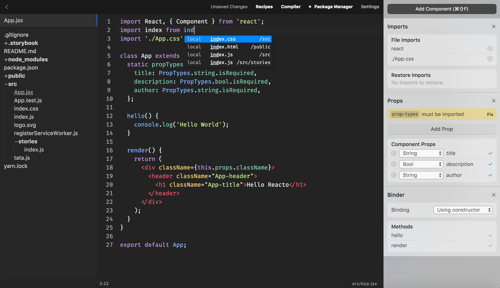
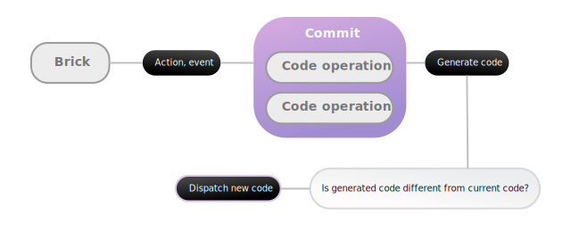

<p align="center">
  
</p>

👋 **Interact with your code:** use bricks to play with *props*, *imports* or quickly change a component type.  
⚡️ **Package Manager out of the box:** add, upgrade, delete and search dependencies in a flash.  
✨ **Smart and fast autocomplete:** automatically find relative path to any file, quick snippets and more to come.  
🌖 **Preview components, quickly:** press `Cmd+R` to toggle the component previewer. That's it.  



- [Download on MacOS](https://github.com/eveningkid/reacto/releases/download/v0.1.0/Reacto-0.1.0.dmg)
- Other versions aren't available yet as I have no Windows/Linux computer at hand. Please, help to make Reacto available on all platforms.
- [One last thing](#one-last-thing)  

**Reacto is still a work in progress. That means it's extremely likely that you'll encounter issues. Always consider it.**  

## Why?
There is absolutely no free software, all-included for React development. The idea is to create the right tool for everyone, to build ideas faster. This is a community project, using plain React code. Anyone can contribute and make it better. Anyone can suggest ideas and help everyone having the perfect tools in their hands. This is what Reacto aims to be: useful.

## Quick tips
- Reacto introduces a concept of "components" (also called "bricks" if you check the code). Components are in a way similar to Unity components. They are tools that give you super powers to quickly interact with your code. Give it a try, hit the `Cmd+Shift+F` to get started.
- Quickly access the package manager using `Cmd+Shift+P`.
- Install multiple packages at once by separating them with a space, e.g `redux react-redux`, as many as you want.
- Navigate through opened files with `Ctrl+Tab`, add `Shift` to go backwards.
- Press `Cmd+R` to toggle component preview *(still a work in progress)*.
- Find files and word occurrences using `Cmd+F`.
- **If something goes wrong,** share your experience on the repo ("Issues" tab) and press `Cmd+Shift+R`. This should be fixed asap. 🙇‍

## Things you need to know
- In its current state, Reacto is a work in progress. I have hope that other developers will join to make it greater. If you want to be part of it, you're more than welcome.
- This initiative doesn't mean that other softwares are bad. Reacto is unique in the way it is open-source and targeted at React development. You can still happily do programming using other solutions.
- You don't need to be an expert to help: Reacto code doesn't use typescript, neither flow. As long as you know javascript and its latest syntax, you're ready to join the community. If you are still a beginner, suggesting ideas is also a necessary thing to become better. Reacto needs to be simple, no matter how good you are at React. Please, share feedback, share your feelings.
- Reacto is a "suggestion". I worked on this project as I personally felt that this would help many people, if we would all come together around this project and build a great experience. This can be as successful as it can be a total failure. It depends on everyone!

## Contribute
Reacto uses [React](https://reactjs.org) and [Electron](https://electronjs.org). That is all the knowledge you need to help. If you're new to Electron, no worries. It is no magical and [very easy to get along with](https://electronjs.org/docs).  

**How to contribute?**  

Simply fork the repository, install dependencies (`yarn install`) and run the application locally:
- separately (recommended):
  - development server (webpack): `yarn start`
  - electron preview: `yarn run electron`
- all at once: `yarn run electron:dev`

Before opening a pull request, try your changes using `yarn run dist:pack`.
If when running the generated executable file everything runs fine, feel free to send your pull request. 💌

**Any contributor can add a quote to the editor placeholders (that quote you see every time the code editor is empty). Simply suggest yours by modifying `src/editor/placeholders.js`.**

## Build
`yarn run dist:pack`. Executable files should appear inside the `dist` folder.

## File structure
This project was bootstrapped with [Create React App](https://github.com/facebookincubator/create-react-app), then ejected. Meaning the whole configuration can be tweaked.

- `config`, any configuration file related to the development server
- `dist`, will appear after packing (cf "Build")
- `public`: main process code (*everything the user don't see*). Window handler, application menu, background workers.
  - `/heavy-operations`, contain any heavy operations that shouldn't be held by the view
  - `/window`, only contain the application menu so far, anything related to the main window should end up there
  - `index.html`, application view container (create-react-app default index file)
  - `main.js`, script that bootstrap and handle the application
- `scripts`, nothing important to be seen here
- `src`: *where the magic happens* 🧙
  - `/bricks`, all the **components/bricks**. Understand, all the quick tools to interact with code. Each folder represents a brick. Each brick is represented by a `brick.js` file (that holds all the logic) and `renderer.js` which is basically a React component, displaying the state from its parent, `brick.js`. More details below about bricks.
  - `/components`: all the React components from the UI
    - `/_ui`, any common UI component (Button, Alert, Container...)
    - `/_containers`, are not React containers. More like important wrappers such as the project's *Root*, or *EditorWrapper*
    - `/**`, everything else. Their names should all be pretty explicit. If not, do not hesitate to suggest another name!
  - `/editor`: all the editor's logic
    - `/events`, every event that can be triggered by a key
    - `/hint`: contain everything related to autocompletion and snippets. More information below in "Editor#Hint, autocomplete"
      - `/modes`, each file there is associated to a code "mode". Basically, if you want to add `sass` suggestions, you would simply create a new file called `hint/modes/sass.js`
      - `/snippets`, similar to `modes` but this time only return a list of code snippets, aiming to generate more code by calling simple keywords
      - `index.js`, register every hinter and snippets and let the user benefit from them
    - `/managers`: easily access complex editor elements (os notifications, global events, parent process...)
      - `/application`, represent the whole application. Its `.environement` attribute is extremely useful to run commands or fetch specific information about the running environment
      - `**`, anything else, still important
    - `/search`: contain everything related to global search
      - `/plugins`, each plugin bring another feature to the search command
    - `/lib`, any external library that somehow couldn't be imported **and** exported using `node_modules`. *Should be avoided*
    - `/menus`, specific context menus. More information below
  - `/store`:
    - `/models`, each *model* is actually a [rematch reducer](https://github.com/rematch/rematch). If you're familiar with [Redux](https://redux.js.org/), there should be no difficulty understanding this library. I recommend it to you by the way, it's pretty neat
    - `index.js`, import every plugin and reducers, then bootstrap our app's store and export it
  - `/themes`: anything related to general design: editor theme, fonts, syntax highlighter
    - `/editor`, general application theme. Only *dark* for now
    - `/fonts`, fonts. Fonts.
    - `/syntax`, any syntax highlighter for the code editor
  - `/tools`, read more below
  - `/utils`, pretty straight-forward. Give it a look if you're curious or need more helpers  

## Editor
The editor's logic lives inside `src/editor`. I tried to keep its structure as simple as possible but it will for sure evolve over time. The following sections describe which elements the editor requires to work.  

### Managers
Managers' goal is to abstract complex operations. You want to run a command and fetch its output? Use `ApplicationManager.environment.run` method. You need to send an os notification? Use `NotificationsManager.success` to do so. You need to ask something to the user? Call `PromptUserManager.ask`. Basically, a manager should simplify a process. It should provide only static methods that can therefore be accessed from anywhere without spending time instantiating it.

### Menus
If you want to add any customised menu when clicking somewhere on the editor, create a new file inside `src/menus` extending `_base-menu.js` (please refer to `file-tree-entry-menu.js` to get a *meaningful* example). Then export it inside `src/menus/index.js` and import it whenever you need it.  

To open one of these menus manually:
```js
import { specificMenu } from '../menus';

<div
  onContextMenu={(event) => {
    event.stopPropagation();
    // You can also pass no data to .open(...), consider the following
    // as a plain example
    menuName.open({ title: 64, description });
  }}
/>
```

### Bricks
Whenever the current code is updated, a brick will receive the raw code, an AST and the current state of the application.  
What is also worth noting is that there is a two-way binding. If the user directly interacts with the brick (e.g add a new prop to the component), this will trigger a `CodeOperation` which will be executed through a `Commit`. The idea behind this is that you can generate/update/remove code directly when interacting from the brick renderer. When the new code is generated, if the output is different from the current code, the generated code will be dispatched to the editor. Afterwards, the updated code will be sent through all the bricks once again so each brick can update its renderer.

#### From current code to brick


#### From brick to current code


Each `CodeOperation` is using [facebook/jscodeshift](https://github.com/facebook/jscodeshift) to update tree nodes from AST. It is actually very tedious to use it **but** as soon as your understand how it works, it looks like magic. You can learn by reading code from the basic available bricks.  

Also, I mentioned that each `CodeOperation` is wrapped into a `Commit`. When your operation is ready, add it to a new commit and run it to update current code:  

```js
const replaceVariableName = new CodeOperation((parsed) => ...);
new Commit(replaceVariableName).run();
```

*Note: a commit can contain a list of code operations. You can also use new Commit().addCodeOperation(...).run().*

### Hint, autocomplete
To bring autocompletion feature, Reacto provides modes and snippets.  

#### Modes
A mode's job is to return suggestions when autocompletion is running. To improve it, check any hinter's `getSuggestions` method. Only this method will be called from the outside. It awaits for a list of suggestions, which are described using the `Suggestion` class.  

Again, reading example codes is self-explanatory —probably more than explaining it with words. Refer to `src/editor/hint/modes` to discover more about the way it works.  

If you plan to create a new hinter i.e a new mode, don't forget to import it inside `src/editor/hint/index.js` which contains an instance of each hinter, used by the global autocompletion manager.

#### Snippets
To add snippets, create a new file that fits an editor code mode, i.e if there is a `/modes/sass.js`, then your snippets' name will be `snippets/sass.js`.  

A snippets file is a simple exported *Array*:  

```js
export default [
  {
    displayText: 'Mode: import',
    text: "import #{1} from '#{1}';\nconsole.log(#{1})",
  },
  // ...
];
```

`.displayText` is useful to be found by the user when looking for a snippet, and `.text` is what will appear in the code editor. For now, **if you need variables, only 1 variable can be integrated** due to CodeMirror limitations. This could be improved by working on `editor/hint/snippet.js`.  

To use variables, write `#{1}` whenever you need a cursor to be placed at this exact position. Refer to any file inside `editor/hint/snippets` to get more insights.  

### Events
Is considered an editor's event, a triggered key combination. All of the events has to be included inside `src/editor/events`, one file for each event. Check files there, you'll quickly get the idea.  

When your event code is ready, explicitly tell `EditorManager` how to react to the event. Open `src/editor/events/index.js` and follow the current format to listen and associate a callback to a given event.  

**The final step** is to tell Electron when should this event be sent to the view.
- **If the event is triggered by a global application shortcut,** add it to `public/window/menu.js`
- **If the event is triggered by a local shortcut from the view,** find more details inside `src/menus/file-tree-entry-menu.js` for an example. The code is similar to the one from the global application. The only difference is that these menus are usually customised with local information (`file-tree-entry-menu` needs to act differently regarding which file is clicked, e.g different file path).

### Tools
**tldr;** tools are meant to be facilitators between a project and console. They should simplify actions and commands we usually forget about or are too complex when you only want to things to work.  
[~ Read more about tools](src/tools)

### UI Components
*Is it going to be used many times? Is it that common and abstract?* Put it inside `_ui`.  
*Is it a big wrapper for root components?* Put it inside `_containers`.  
*Otherwise,* add it to `/components`.  
Every new component should have its own Sass file if necessary (`ComponentName.scss`) and be named as follow `ComponentName/ComponentName.jsx`.  
Then import it into `src/components/index.js`.

## One last thing
I worked on this project with all my heart. I truly spent nights, not sleeping, working on it. The only thing that kept me doing was knowing that this will soon be shared with all of you. Hoping that people will find it interesting and eventually decide to push this tool forward, together. I sincerely wish that someone will feel the same way I do about this project. Reacto needs time to become great, and this can only be achieved collectively. Never hesitate to share new ideas, no matter how crazy it sounds. I can't wait to see what everyone will come up with! Don't be shy, and let's start creating together. ⚡️

## License
[eveningkid](https://twitter.com/eveningkid) @ MIT
